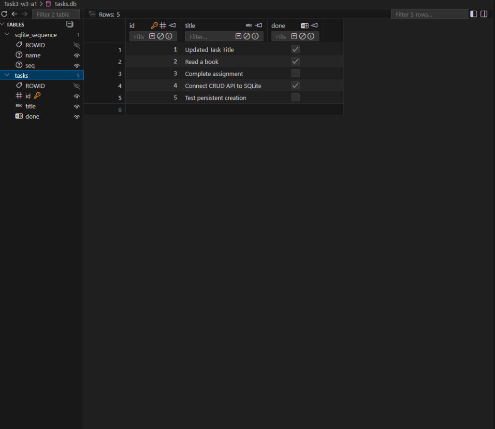

# Assignment W3 · A1 — Connecting Task CRUD to SQLite Database

A Flask RESTful API for task management backed by a persistent **SQLite** database (`tasks.db`). This project replaces in-memory storage with a real database while keeping the exact same REST API interface contracts.

---

## Why SQLite Was Chosen

1. **Zero Configuration**: SQLite is self-contained and requires no separate database server daemon or installation.
2. **Single-File Persistence**: All tables, schema definitions, and records are stored in a single computer file (`tasks.db`).
3. **Data Survival**: Unlike in-memory arrays, data saved to SQLite survives server restarts and crashes.
4. **Clean API Separation**: Replaces the internal storage layer behind the API without changing endpoints, request parameters, or response formats for clients.

---

## Database File Location & Schema

* **Database File**: `Task3-w3-a1/tasks.db` (automatically created on first application startup and git-ignored).
* **Table Schema**:
  ```sql
  CREATE TABLE IF NOT EXISTS tasks (
      id INTEGER PRIMARY KEY AUTOINCREMENT,
      title TEXT NOT NULL,
      done BOOLEAN NOT NULL DEFAULT 0
  );
  ```
* **Auto-Seeding**: Upon application startup, if the `tasks` table is empty, 3 initial example tasks are automatically seeded once:
  1. `"Buy groceries"` (`done = False`)
  2. `"Read a book"` (`done = True`)
  3. `"Complete assignment"` (`done = False`)

---

## How to Install & Run

1. **Install dependencies**:
   ```bash
   pip install -r requirements.txt
   ```

2. **Run the server**:
   ```bash
   python app.py
   ```
   *The server starts on `http://127.0.0.1:5000`.*

3. **Run unit tests**:
   ```bash
   python -m unittest test_app.py
   ```

---

## API Endpoints

| Method | Endpoint | Description | Expected Status Codes |
| :--- | :--- | :--- | :--- |
| `GET` | `/tasks` | List all tasks | `200 OK` |
| `GET` | `/tasks/<id>` | Fetch single task by ID | `200 OK`, `404 Not Found` |
| `POST` | `/tasks` | Create new task (`{"title": string, "done": bool}`) | `201 Created`, `400 Bad Request` |
| `PUT` | `/tasks/<id>` | Update task by ID (`title`, `done`) | `200 OK`, `404 Not Found`, `400 Bad Request` |
| `DELETE` | `/tasks/<id>` | Delete task by ID | `200 OK`, `404 Not Found` |

### Sample `curl` Commands

```bash
# 1. Fetch all tasks
curl -i http://127.0.0.1:5000/tasks

# 2. Fetch task by ID
curl -i http://127.0.0.1:5000/tasks/1

# 3. Create a new task
curl -i -X POST http://127.0.0.1:5000/tasks \
  -H "Content-Type: application/json" \
  -d '{"title": "Complete Week 3 Assignment", "done": false}'

# 4. Update task
curl -i -X PUT http://127.0.0.1:5000/tasks/1 \
  -H "Content-Type: application/json" \
  -d '{"title": "Buy organic groceries", "done": true}'

# 5. Delete task
curl -i -X DELETE http://127.0.0.1:5000/tasks/1
```

---

## Stage 4: Executed Raw SQL Queries

The following queries were executed directly against `tasks.db`:

```sql
-- 1. List every task
SELECT * FROM tasks;

-- 2. Show only completed tasks
SELECT * FROM tasks WHERE done = 1;

-- 3. Count total tasks
SELECT COUNT(*) FROM tasks;

-- 4. Mark all tasks as completed
UPDATE tasks SET done = 1;

-- 5. Delete completed tasks
DELETE FROM tasks WHERE done = 1;
```

---

## Verification of Persistence

1. Start the Flask server with `python app.py`.
2. Send a `POST /tasks` request to insert a new task.
3. Stop/restart the server (`Ctrl+C` then `python app.py`).
4. Perform `GET /tasks` — the newly created task persists across the restart.

---

## Database Viewer Screenshot

Below is the screenshot of `tasks.db` open in the VS Code SQLite Viewer showing the active `tasks` table schema (`id`, `title`, `done`) and records:



